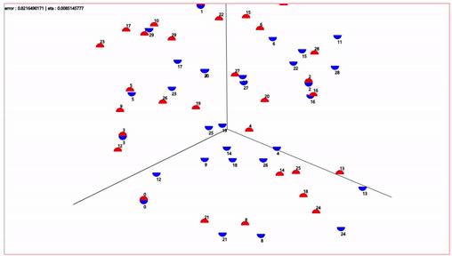

<h1 align="center">Tracking-Simulation</h1>

<a href="https://erados.github.io/2022_Tracking_Simulation/simulation.html">simulation</a> &middot; <a href="./etc/poster_draft.pdf">poster(draft)</a> 

**Tracking simulation** is a simulation of an algorithm that tracks all the positions of a device, given all the distance information between each device.
